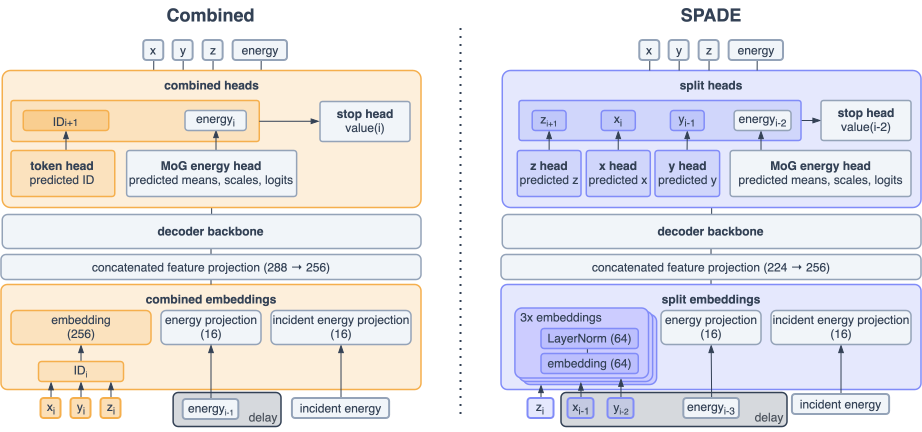

# SPADE: Split-and-Delay Embeddings for Autoregressive High-Granularity Calorimeter Simulation

<div align="center">

Joschka Birk, Frank Gaede, Anna Hallin, Gregor Kasieczka, Martina Mozzanica, Henning Rose

[](https://arxiv.org/abs/2606.11304)
[](https://pytorch.org)
[](https://lightning.ai)
[](https://hydra.cc)

</div>

**Abstract**:

> We introduce SPADE (SPlit And Delay Embeddings), an autoregressive transformer for sequences whose tokens carry multiple features. Rather than embedding these features jointly, SPA1DE embeds them independently. Delaying each feature stream relative to the previous one allows intra-token correlations to be learned by the standard self-attention mechanism. Applied to point-cloud calorimeter shower generation in the highly granular ILD detector, SPADE is competitive with the state of the art AllShowers model on photon showers, and substantially outperforms its VQ-VAE-based predecessor OmniJet-αC . The mechanism is applicable to any generative task with multi-feature tokens, enabling LLM-style pretraining workflows for higher-dimensional data.

<p align="center">
  
</p>

**humite** generates high-granularity calorimeter showers as **point clouds** with an
autoregressive transformer. It is the reference implementation for **SPADE**
(*Split-and-Delay Embeddings*): each hit's features — the three spatial coordinates
`x`, `y`, `z` and the deposited energy `E` — are embedded *independently* and staggered
(*delayed*) along the sequence, so the standard causal self-attention recovers the
intra-hit correlations while the spatial vocabulary grows only linearly (`N_x + N_y + N_z`)
with detector granularity instead of cubically.

The repository implements two autoregressive models, selected via `dataset.axis_mode`:

- **SPADE** (`axis_mode: split`) — factorized per-axis embeddings + delay (the paper's main model).
- **Combined** (`axis_mode: combined`) — a single combined spatial vocabulary (`N_x·N_y·N_z`) baseline.

Both replace the lossy VQ-VAE tokenizer of the predecessor model OJAC, predict per-hit
energy with a mixture-of-Gaussians head, and terminate showers with a dedicated stop head
(so generation is variable-length and not conditioned on the number of hits).

## Highlights

- **Split-and-delay embeddings (SPADE).** Per-axis `x`/`y`/`z` embeddings are staggered
  along the sequence (`z_i, x_{i-1}, y_{i-2}, E_{i-3}`), so intra-hit correlations are
  learned by causal attention while the spatial vocabulary scales linearly with granularity.
- **GPT-style decoder** ([`core/models/gpt_decoder.py`](humite/core/models/gpt_decoder.py))
  with RoPE, multi-query attention, optional Flash-Attention and KV-caching for fast
  generation. Trained with the Ranger optimizer (RAdam + Lookahead).
- **Conditioning** on incident energy and (optionally) the total number of hits.
- **Mixture-of-Gaussian energy head** ([`core/models/heads.py`](humite/core/models/heads.py))
  for per-hit energies.
- **Stop head** ([`core/models/physics_stop.py`](humite/core/models/physics_stop.py))
  — a separate predictor that decides when a shower ends, enabling variable-length
  generation.
- **Hydra-configured** training with Comet logging, EMA weights and moving-average early
  stopping.

## Repository structure

```
humite/
├── core/            # stable, reusable code
│   ├── models/      # transformer decoder, heads, physics-stop, factory
│   ├── data/        # iterable datasets, datamodules, preprocessing, geometry
│   ├── callbacks/   # generative evaluation, EMA, early stopping, compute tracking
│   ├── training/    # Lightning trainer factory
│   ├── registries/  # build models / datasets from config
│   └── utils/       # logging, checkpoints, optimizers, environment setup
├── cli/             # entry points (train, generate)
├── config/          # Hydra configs (one example: ECAL)
```

## Installation

Everything ships in one image on Docker Hub — `henningrose/humite:1.0.8` — with
all dependencies and the `humite` code baked in, so `humite-train` /
`humite-generate` work out of the box. Just run it:

```sh
docker run -it --rm henningrose/humite:1.0.8 bash
```

No Docker (e.g. on an HPC cluster)? The same image runs via Singularity or
podman — no local image file to build:

```sh
singularity run --nv docker://henningrose/humite:1.0.8   # --nv exposes the GPU
podman run -it --rm henningrose/humite:1.0.8 bash
```

Or install into your own Python environment (≥ 3.10): `pip install -e .`.

## Dataset and environment

Showers are read from HDF5 files (ECAL photon showers, 10–100 GeV in the example
config). Point the loader at your data and choose where outputs/logs are written via
environment variables (a `.env` file in the repo root is picked up automatically):

```sh
HUMITE_DATA_DIR="<directory containing the .h5 shower files>"
HUMITE_OUTPUT_DIR="<directory for run outputs and checkpoints>"   # defaults to ./outputs
COMET_API_TOKEN="<your Comet API token>"   # leave empty to log offline
HYDRA_FULL_ERROR=1
```

The file lists and binning are defined in
[`config/dataset/ecal.yaml`](humite/config/dataset/ecal.yaml); adjust the glob patterns
to match your filenames.

## Training

The default configuration ([`config/config.yaml`](humite/config/config.yaml)) trains the
ECAL model:

```sh
# any of these are equivalent
humite-train
python -m humite.cli.train
python humite/cli/train.py
```

Everything is overridable from the command line via Hydra, e.g.:

```sh
# point at your data and shorten a smoke-test run
python -m humite.cli.train \
    dataset.data_dir=/path/to/dataset \
    trainer.batch_size=8 \
    trainer.max_steps=1000

# resume from a checkpoint
python -m humite.cli.train trainer.resume_ckpt_path=/path/to/last.ckpt

# warm-start (transfer-learning) from pretrained weights
python -m humite.cli.train init_weights.ckpt_path=/path/to/weights.ckpt
```

On a cluster a SLURM job wraps the same command — `singularity` (or `podman`)
runs the published image straight from Docker Hub, no local image file needed
and no `source activate` (the entry points are already on `PATH`):

```sh
singularity exec --nv --bind /data:/data docker://henningrose/humite:1.0.8 \
    humite-train dataset.data_dir=/data/your_dataset
```

## Pretrained checkpoints

Checkpoints are hosted separately to keep the repo small. Download them with:

```sh
cd checkpoints && ./download_checkpoints.sh
```

## Generating showers from a trained model

Once you have a checkpoint (your own training run or a downloaded one), generate showers
with the `humite-generate` CLI. It rebuilds the model from the same config, loads the
weights, samples incident energies, and writes decoded hits (`x, y, z, E`) + a per-hit
mask to an HDF5 file:

```sh
# 1000 showers, incident energy uniform in [10, 100] GeV
humite-generate +generate.checkpoint=checkpoints/spade/getting_high/model.ckpt

# fixed energy, custom count and output path
humite-generate \
    +generate.checkpoint=checkpoints/spade/getting_high/model.ckpt \
    +generate.energy_gev=50 \
    +generate.n_showers=5000 \
    +generate.output=showers_50gev.h5
```

The `config.yaml` shipped next to each checkpoint is loaded automatically, so the
architecture (`axis_mode`, binning), sampling, and any postprocessing always match
the weights — **no overrides needed**, and the command is identical for every
checkpoint (SPADE or Combined, any granularity). Point at a different config with
`+generate.config=/path/to/config.yaml`.

The SPADE checkpoints also carry the energy-sum lower-envelope filter described in
the paper (App. Postprocessing): showers whose total deposited energy falls below
`s·(a·E_inc^b + c)` are regenerated under the same conditioning. It is configured in
the checkpoint's `config.yaml` and applied automatically.

For a worked example that generates showers and plots them, see
[`examples/generate_and_plot.ipynb`](examples/generate_and_plot.ipynb).

## Monitoring during training

Training is logged to [Comet](https://www.comet.com/) (set `COMET_API_TOKEN`; runs go
offline if it is empty). The generative-evaluation callback
([`core/callbacks/generative_eval.py`](humite/core/callbacks/generative_eval.py))
periodically samples showers and writes comparison plots/artifacts to the run directory
(`${HUMITE_OUTPUT_DIR}/runs/<...>/plots`), so generation quality is tracked as training
progresses.

## Reproducing the paper

The paper studies photon showers at several granularities (the regular-grid *GettingSquare*
x1/x4/x16 datasets and the irregular *GettingHigh* dataset). The shipped example config
trains the ECAL/*GettingHigh* setup; train other granularities by overriding the binning
and data path (e.g. `dataset.nbins_x=60 dataset.nbins_y=60 dataset.data_dir=...`), and
switch the Combined baseline on with `model.kwargs.axis_mode=combined` (with the matching
`dataset.axis_mode`).

## Citation

If you use this code, please cite:

```bibtex
@misc{birk2026spades,
      title={SPADE: Split-and-Delay Embeddings for Autoregressive High-Granularity Calorimeter Simulation},
      author={Joschka Birk and Frank Gaede and Anna Hallin and Gregor Kasieczka and Martina Mozzanica and Henning Rose},
      year={2026},
      eprint={2606.11304},
      url={https://arxiv.org/abs/2606.11304},
}
```
